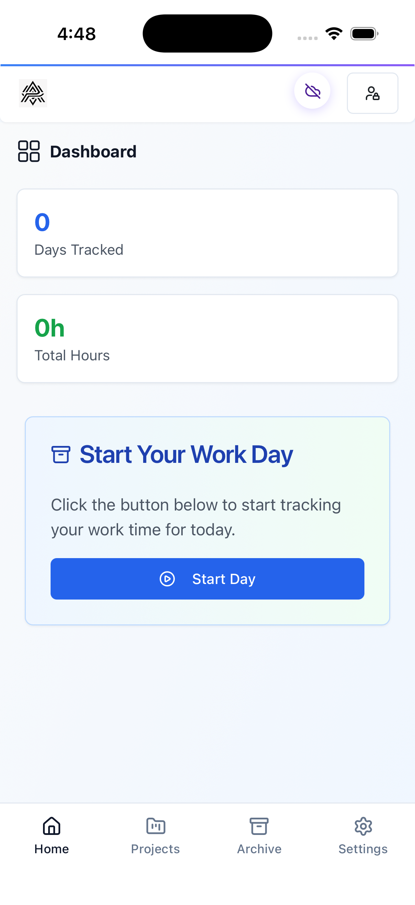
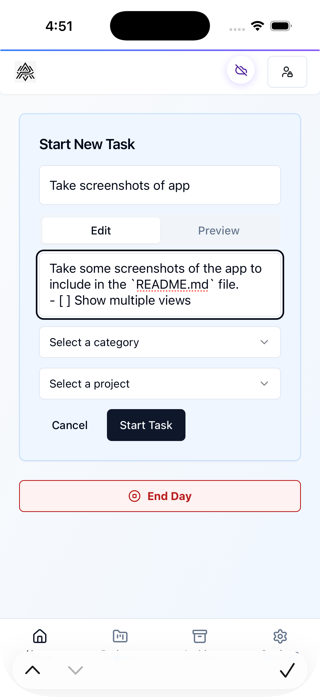
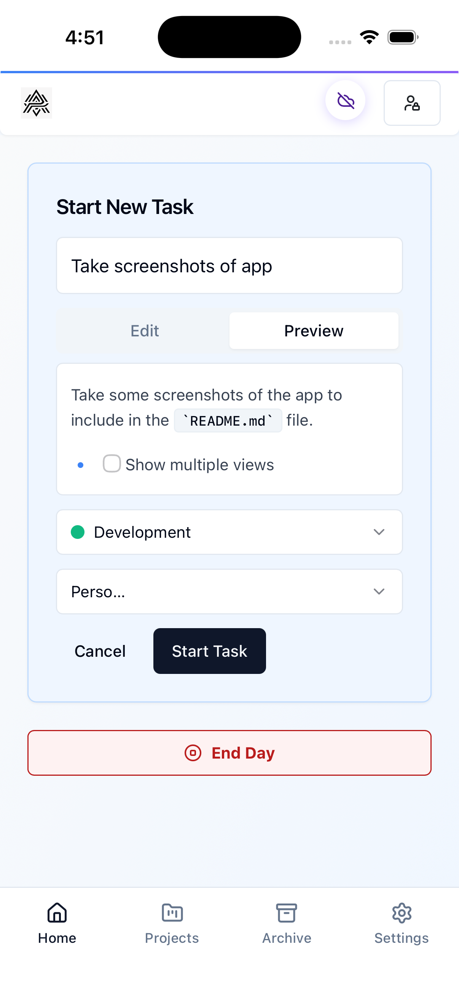
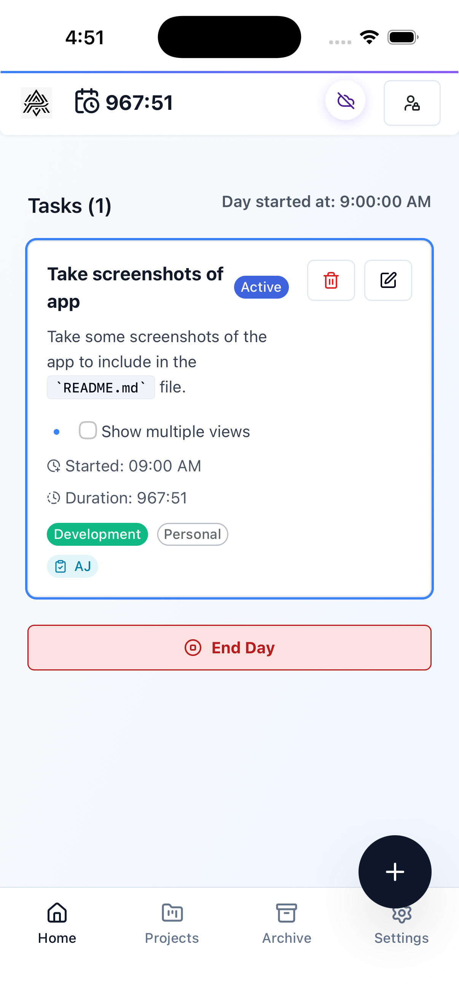
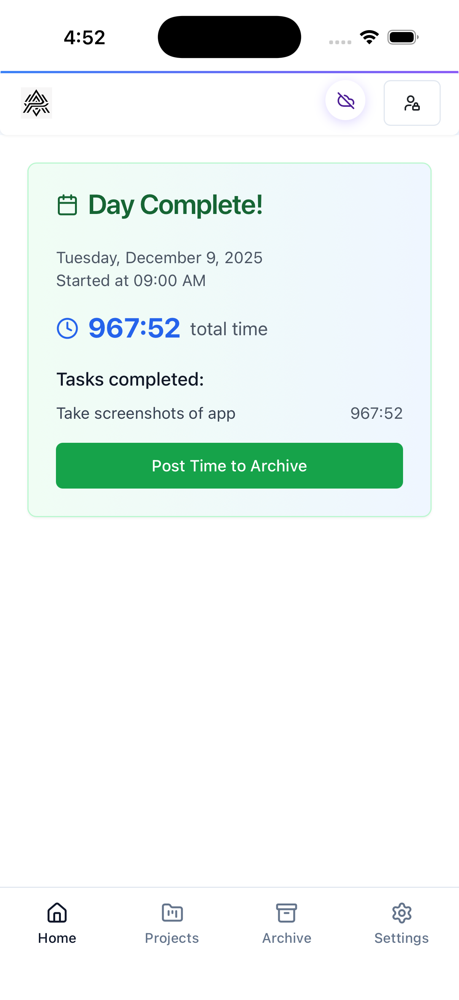
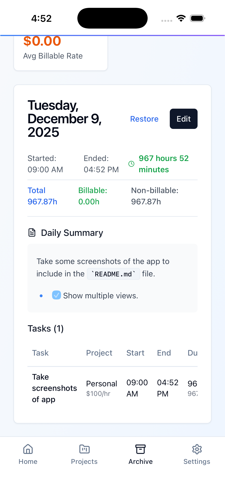

# TimeTracker Pro

A modern, feature-rich Progressive Web App (PWA) for time tracking built with React, TypeScript, and Tailwind CSS. Installable on desktop and mobile devices with full offline support. Perfect for freelancers, consultants, and professionals who need to track time, manage projects, and generate invoices.

     

## 📑 Table of Contents

**For Users:**

- [What is TimeTracker Pro?](#-what-is-timetracker-pro)
- [Key Features](#-key-features)
- [Perfect For](#-perfect-for)
- [Quick Start](#-quick-start)
- [How to Use](#-how-to-use)
- [Progressive Web App](#-progressive-web-app)

**For Developers:**

- [Development Setup](#-development-setup)
- [Technical Architecture](#-technical-architecture)
- [Authentication & Storage](#-authentication--storage)
- [Development Workflow](#-development-workflow)
- [Documentation](#-documentation)

**Screenshots:**

- [iOS](#-ios-screenshots)- [Dashboard](screenshots/iOS/01TimeTrackerPro-iOS.png)

**Additional:**

- [License](#-license)
- [Credits](#-credits)

---

## 🎯 What is TimeTracker Pro?

TimeTracker Pro is a professional time tracking application that helps you monitor where your time goes throughout the workday. Unlike complex enterprise tools, TimeTracker Pro focuses on simplicity while providing powerful features for freelancers, consultants, and professionals.

**Core Concept:**

1. **Start your day** - Click one button to begin tracking
2. **Create tasks** - Add tasks as you work on different projects
3. **End your day** - Review your summary and archive the day
4. **Export data** - Generate invoices, CSV reports, or JSON exports

**Works Your Way:**

- **No Account Required** - Start tracking immediately with local storage
- **Optional Cloud Sync** - Sign in to sync across devices
- **Offline First** - Full functionality without internet connection
- **Install as App** - Works like a native app on desktop and mobile

---

## ✨ Key Features

### Time Tracking Essentials

- **Daily Time Tracking** - Start/stop your workday with clear boundaries
- **Task Management** - Create, edit, and delete tasks with real-time duration tracking
- **Rich Text Support** - Add detailed notes with GitHub Flavored Markdown (tables, lists, formatting)
- **Automatic Calculations** - Duration and revenue calculated automatically
- **Archive System** - Permanent record of all completed work days

### Organization Tools

- **Projects & Clients** - Organize work by project with hourly rates
- **Custom Categories** - Flexible categorization with custom colors
- **Billable vs Non-Billable** - Track which time can be invoiced
- **Visual Organization** - Color-coded categories for quick identification

### Professional Features

- **Revenue Tracking** - Automatic earnings calculation based on hourly rates
- **Invoice Generation** - Export invoice-ready data filtered by client and date range
- **Multiple Export Formats** - CSV, JSON, and invoice formats
- **CSV Import** - Import existing time data from other tools
- **Print Support** - Print-friendly archive views for physical records

### Progressive Web App

- **Install Like Native** - Add to home screen or applications folder
- **Full Offline Support** - Continue working without internet
- **Mobile Optimized** - Touch-friendly with bottom navigation
- **Auto-Updates** - New versions install seamlessly
- **Cross-Platform** - Works on Windows, Mac, Linux, iOS, and Android

---

## 🎯 Perfect For

- **Freelancers** - Track billable hours and generate client invoices
- **Consultants** - Organize time by project and client with revenue tracking
- **Remote Workers** - Submit detailed timesheets to employers
- **Students** - Track study time and project work efficiently
- **Small Businesses** - Monitor project time and profitability
- **Anyone** - Who needs professional time tracking without the complexity

---

## 🚀 Quick Start

**Option 1: Use Online** (No installation required)

1. Visit the hosted version (if available) or run locally
2. Click "Start Day" to begin tracking
3. Add tasks throughout your day
4. Click "End Day" and archive when finished

**Option 2: Install Locally**

```bash
# Clone the repository
git clone https://github.com/AdamJ/TimeTrackerPro.git

# Navigate to project directory
cd TimeTrackerPro

# Install dependencies
npm install

# Start the application
npm run dev
```

The application will be available at **<http://localhost:8080>**

**First Time Setup:**

1. Open the app in your browser
2. Click "Start Day" to begin tracking time
3. (Optional) Click "Sign In" to enable cloud sync across devices
4. (Optional) Set up projects and categories for better organization

That's it! No complex configuration required.

---

## 📱 How to Use

### Daily Workflow

**Morning:**

1. Click "Start Day" button to begin tracking
2. The timer starts automatically

**Throughout the Day:**
3. Click "New Task" to create a task
4. Fill in task details:

- **Title** (required) - Brief description of the work
- **Description** (optional) - Detailed notes with markdown support
- **Project** (optional) - Assign to a client/project
- **Category** (optional) - Categorize the work type

1. Task duration calculates automatically
2. Create new tasks as you switch between different work items

**Evening:**
7. Click "End Day" when you're finished working
8. Review your day summary (total time, revenue, task breakdown)
9. Click "Post Time to Archive" to save permanently

**Ongoing:**

- View archived days in the **Archive** page
- Manage projects and rates in **Archive → Projects**
- Customize categories in the **Categories** page
- Export data via **Archive → Export**

### Project Management

**Setting Up Projects:**

1. Navigate to **Archive** page
2. Click **Projects** button
3. Click **Add Project**
4. Enter project details:
   - Project name
   - Client name
   - Hourly rate
   - Mark as billable/non-billable
5. Assign projects to tasks when creating them

**Benefits:**

- Automatic revenue calculation based on hourly rates
- Filter archives by project
- Generate client-specific invoices
- Track time and earnings per project

### Category Management

**Customizing Categories:**

1. Navigate to **Categories** page from the main menu
2. View default categories or create new ones
3. Click **Add Category** to create custom categories
4. Customize each category:
   - Category name
   - Color (for visual identification)
   - Billable flag (for invoice generation)

**Default Categories:**

- Meeting, Development, Design, Research
- Administration, Testing, Documentation
- Client Communication

### Data Export & Import

**Exporting Data:**

1. Navigate to **Archive** page
2. Click **Export** button
3. Choose export format:
   - **CSV** - For Excel, Google Sheets, or accounting software
   - **JSON** - For programmatic access or backup
   - **Invoice** - Client-ready invoice format
4. Filter by date range, project, or client
5. Download the file

**Importing Data:**

1. Prepare a CSV file using the template format (see [CSV Templates](docs/CSV_TEMPLATES_README.md))
2. Use the import functionality (coming soon) or test scripts:

   ```bash
   npm run test-csv-import
   ```

### Markdown in Task Descriptions

Task descriptions support **GitHub Flavored Markdown (GFM)** for rich formatting:

**Supported Features:**

- **Bold** and *italic* text
- Lists (bulleted and numbered)
- Task lists with checkboxes
- Tables
- ~~Strikethrough~~
- Links
- Code blocks
- Headings
- Automatic line breaks

**Example:**

```markdown
## Client Meeting Notes

**Attendees:** John, Sarah, Mike

**Topics Discussed:**
1. Q1 project timeline
2. Budget approval
3. Design mockups

**Action Items:**
- [ ] Send meeting minutes
- [ ] Update project roadmap
- [ ] Schedule follow-up

**Next Meeting:** 2024-02-15
```

This renders beautifully in the task view with proper formatting and styling.

---

## 📲 Progressive Web App

### Installing as an App

**Desktop (Chrome/Edge/Firefox):**

1. Open TimeTracker Pro in your browser
2. Look for the install icon (⊕) in the address bar
3. Click "Install" when prompted
4. The app opens in its own window
5. Find it in your Applications folder or Start menu

**iOS (Safari):**

1. Open TimeTracker Pro in Safari
2. Tap the Share button (□↑)
3. Scroll and tap "Add to Home Screen"
4. Tap "Add" to confirm
    - Toggle "Open as Web App" to "On"
5. Find the app icon on your home screen

**Android (Chrome):**

1. Open TimeTracker Pro in Chrome
2. Tap the menu (⋮) in the top-right
3. Tap "Install app" or "Add to Home screen"
4. Follow the prompts
5. Find the app in your app drawer

### PWA Features

**Offline Capability:**

- Continue tracking time without internet
- All features work offline
- Data syncs automatically when connection restored
- Service worker caches app for instant loading

**Mobile Optimized:**

- Bottom navigation for easy thumb access
- 44×44px minimum touch targets (accessibility compliant)
- Safe area support for notched devices (iPhone X+)
- Responsive design adapts to any screen size
- Landscape and portrait orientations supported

**Seamless Updates:**

- New versions install automatically
- Update notification prompts you to refresh
- No data loss during updates
- Version management handled transparently

**Native-Like Experience:**

- Standalone window without browser UI
- Professional app icon
- Splash screen on launch
- Fast, responsive interactions

---

## 🔧 Development Setup

### Prerequisites

- **Node.js** 18+ and npm
- **Git** for version control
- (Optional) **Supabase account** for cloud sync features

### Installation

```bash
# Clone the repository
git clone https://github.com/AdamJ/TimeTrackerPro.git

# Navigate to project directory
cd TimeTrackerPro

# Install dependencies
npm install
```

### Environment Setup (Optional)

Cloud sync and authentication require Supabase credentials:

```bash
# Copy environment template
cp .env.example .env

# Edit .env and add your credentials
# VITE_SUPABASE_URL=https://your-project.supabase.co
# VITE_SUPABASE_ANON_KEY=your_anon_key_here
```

**Getting Supabase Credentials:**

1. Create a free account at [supabase.com](https://supabase.com)
2. Create a new project
3. Go to Settings → API
4. Copy the Project URL and anon/public key
5. Paste into your `.env` file

**⚠️ Security Note:** Never commit `.env` to version control!

### Development Server

```bash
# Start development server
npm run dev

# Open in browser
# http://localhost:8080
```

### Available Commands

```bash
# Development
npm run dev              # Start dev server (localhost:8080)
npm run build            # Build for production
npm run build:dev        # Build with development mode
npm run preview          # Preview production build

# Code Quality
npm run lint             # Run ESLint for code quality
npm run test             # Run Vitest unit tests

# PWA Screenshots
npm run screenshots:install   # Install Playwright browsers (first time)
npm run screenshots           # Capture PWA screenshots (headless)
npm run screenshots:headed    # Capture screenshots with visible browser

# CSV Import Testing
npm run test-csv-import       # Test standard CSV import
npm run test-full-import      # Test full CSV import functionality
npm run test-error-handling   # Test CSV error handling
```

---

## 🏗 Technical Architecture

### Technology Stack

**Core Framework:**

- **React 18** - Modern UI framework with hooks and concurrent features
- **TypeScript 5.8** - Type safety and enhanced developer experience
- **Vite 5** - Lightning-fast build tool with SWC for optimal performance

**UI & Styling:**

- **Tailwind CSS 3** - Utility-first CSS framework
- **@tailwindcss/typography** - Beautiful markdown rendering
- **shadcn/ui** - Accessible component library built on Radix UI
- **Radix UI** - Unstyled, accessible component primitives
- **Radix Icons** - Icon library (primary)
- **Lucide React** - Icon library (fallback)

**State & Data:**

- **React Context API** - Global state management
- **React Hook Form** - Form state management with validation
- **Zod** - Schema validation for forms and data
- **Local Storage** - Browser storage for offline data persistence
- **Supabase** (optional) - PostgreSQL database and authentication

**PWA & Performance:**

- **Vite PWA Plugin** - Service worker and manifest generation
- **Workbox** - Advanced service worker caching strategies
- **React Router 6** - Client-side routing with lazy loading
- **Code Splitting** - All pages lazy loaded for optimal performance

**Development & Testing:**

- **Playwright** - Automated screenshot generation and E2E testing
- **Vitest** - Unit testing framework
- **@testing-library/react** - Component testing utilities
- **ESLint 9** - Code quality and style enforcement

### Architecture Patterns

**1. Context-Driven Architecture**

```
App.tsx
└── AuthProvider (authentication state)
    └── TimeTrackingProvider (time tracking state)
        └── OfflineProvider (offline queue)
            └── Pages & Components
```

**2. Service Layer Pattern**

Data persistence is abstracted through a service interface with two implementations:

```typescript
interface DataService {
  loadCurrentDay(): Promise<DayData>
  saveCurrentDay(data: DayData): Promise<void>
  loadArchivedDays(): Promise<ArchivedDay[]>
  saveArchivedDays(days: ArchivedDay[]): Promise<void>
  // ... other methods
}

// Factory pattern selects implementation
const service = createDataService(isAuthenticated)
// Returns: LocalStorageService OR SupabaseService
```

**Benefits:**

- Seamless switching between localStorage and Supabase
- No code changes when user signs in/out
- Easy to test with mock implementations
- Clean separation of concerns

**3. Custom Hooks Pattern**

Complex logic extracted into reusable hooks:

- `useAuth()` - Authentication state and methods
- `useTimeTracking()` - Time tracking operations
- `useOffline()` - Offline queue management

**4. Component Architecture**

```
src/
├── components/
│   ├── ui/                    # Base components (49 files)
│   ├── Feature components     # Domain-specific components
│   └── Layout components      # Navigation, menus
├── pages/                     # Route-level components (lazy loaded)
├── contexts/                  # Global state providers
├── hooks/                     # Custom React hooks
├── services/                  # Data persistence layer
└── lib/                       # Shared utilities
```

### Data Flow

**Standard Operation Flow:**

```
User Action
  ↓
Component Event Handler
  ↓
Context Method (useTimeTracking)
  ↓
State Update (React setState)
  ↓
UI Re-render
  ↓
(On critical events only)
  ↓
DataService.save()
  ↓
localStorage OR Supabase
```

**Critical Save Events:**

- Day end (`postDay()`)
- Window close (`beforeunload`)
- Manual sync button (`forceSyncToDatabase()`)

**Why Manual Sync?**

- Optimized for single-device usage
- Reduces unnecessary database calls
- Prevents rate limiting issues
- User controls when data is saved

### Progressive Web App Implementation

**Service Worker Strategy:**

```javascript
// Caching Strategies
NetworkFirst: Supabase API calls (fresh data preferred)
CacheFirst: Google Fonts (static assets)
Precache: App shell (HTML, CSS, JS, icons)
```

**Manifest Configuration:**

- App name, icons, theme colors
- Display mode: standalone
- Orientation: any
- Icons: 8 sizes (72px to 512px)
- Screenshots: Desktop (1920×1080) and Mobile (750×1334)

**Offline Queue:**

- Actions queued when offline
- Automatic sync when connection restored
- Conflict resolution for data updates
- User notification of sync status

### Project Structure

```
TimeTrackerPro/
├── src/
│   ├── components/              # UI Components
│   │   ├── ui/                 # Base components (49 files)
│   │   ├── ArchiveEditDialog.tsx
│   │   ├── ArchiveFilter.tsx
│   │   ├── ArchiveItem.tsx
│   │   ├── AuthDialog.tsx
│   │   ├── CategoryManagement.tsx
│   │   ├── DaySummary.tsx
│   │   ├── DeleteConfirmationDialog.tsx
│   │   ├── ExportDialog.tsx
│   │   ├── InstallPrompt.tsx
│   │   ├── MarkdownDisplay.tsx
│   │   ├── MobileNav.tsx
│   │   ├── Navigation.tsx
│   │   ├── NewTaskForm.tsx
│   │   ├── ProjectManagement.tsx
│   │   ├── StartDayDialog.tsx
│   │   ├── SyncStatus.tsx
│   │   ├── TaskEditDialog.tsx
│   │   ├── TaskItem.tsx
│   │   ├── UpdateNotification.tsx
│   │   └── UserMenu.tsx
│   ├── config/                 # Configuration
│   │   ├── categories.ts       # Default categories
│   │   └── projects.ts         # Default projects
│   ├── contexts/               # React Context Providers
│   │   ├── AuthContext.tsx
│   │   ├── TimeTrackingContext.tsx
│   │   └── OfflineContext.tsx
│   ├── hooks/                  # Custom Hooks
│   │   ├── useAuth.tsx
│   │   ├── useTimeTracking.tsx
│   │   ├── useOffline.tsx
│   │   └── use-toast.tsx
│   ├── lib/                    # Utilities
│   │   ├── supabase.ts         # Supabase client
│   │   └── utils.ts            # Helper functions
│   ├── pages/                  # Route Components
│   │   ├── Index.tsx           # Home / Time tracker
│   │   ├── Archive.tsx         # Archived days
│   │   ├── ProjectList.tsx     # Project management
│   │   ├── Categories.tsx      # Category management
│   │   ├── Settings.tsx        # App settings
│   │   └── NotFound.tsx        # 404 page
│   ├── services/               # Data Layer
│   │   └── dataService.ts      # Persistence abstraction
│   ├── utils/                  # Utilities
│   │   └── timeUtil.ts         # Time formatting
│   ├── App.tsx                 # Root component
│   └── main.tsx                # Entry point
├── public/
│   ├── icons/                  # PWA icons (8 sizes)
│   ├── screenshots/            # PWA screenshots
│   ├── pwa.css                # PWA styles
│   └── print.css              # Print styles
├── docs/                       # Documentation
├── tests/                      # Test files
├── supabase/                   # Database schema
├── package.json
├── vite.config.ts             # Vite + PWA config
├── tailwind.config.ts         # Tailwind config
└── tsconfig.json              # TypeScript config
```

### Code Conventions

**Critical Requirements:**

- **Indentation**: Tabs only (never spaces), 2-space width display
- **Quotes**: Double quotes (`""`) always, never single quotes
- **Imports**: Use `@/` alias for src imports (never relative paths like `../../`)

**Naming Conventions:**

- **Components**: PascalCase (e.g., `TaskItem.tsx`)
- **Hooks**: camelCase with `use` prefix (e.g., `useAuth.tsx`)
- **Utilities**: camelCase (e.g., `timeUtil.ts`)
- **Constants**: UPPER_SNAKE_CASE (e.g., `STORAGE_KEYS`)

**TypeScript Usage:**

- Loose type checking enabled (`noImplicitAny: false`)
- Use types where helpful, not strictly enforced
- Interface definitions in context files

**Styling:**

- Follow Radix UI design system
- Use shadcn/ui components (don't create custom equivalents)
- Use Tailwind utility classes
- Avoid custom colors (use theme variables)

**See [CLAUDE.md](CLAUDE.md) for comprehensive development guidelines.**

---

## 🔐 Authentication & Storage

### Storage Modes

**Guest Mode (Default):**

- No account required
- All data stored in browser localStorage
- Full functionality available
- Data persists between sessions
- Limited to single device

**Authenticated Mode (Optional):**

- Sign in with email/password via Supabase
- Data synced to PostgreSQL database
- Access from multiple devices
- Automatic data migration from localStorage
- Cloud backup of all data

### How Data Storage Works

**Data Persistence Strategy:**

TimeTracker Pro uses a **manual sync** approach optimized for single-device usage:

1. **In-Memory First** - All changes update React state immediately
2. **Critical Event Saves** - Data persists only on:
   - Day end (when you archive the day)
   - Window close (before you navigate away)
   - Manual sync (clicking the sync button)
3. **No Auto-Save** - Prevents unnecessary database calls and rate limiting

**Why Manual Sync?**

- Reduces API calls (cost-effective)
- Prevents rate limiting issues
- Optimized for single-device usage
- User controls when data is saved
- Faster UI interactions

**Data Migration:**

When you sign in, your localStorage data automatically migrates to Supabase:

- Compares timestamps to prevent overwriting newer data
- Merges local and cloud data intelligently
- Preserves all archived days and tasks
- No data loss during migration

When you sign out, Supabase data syncs back to localStorage for offline access.

### Setting Up Cloud Sync

**1. Create Supabase Project:**

```bash
1. Visit https://supabase.com
2. Create free account
3. Create new project
4. Wait for project to initialize (~2 minutes)
```

**2. Get API Credentials:**

```bash
1. Go to Project Settings → API
2. Copy Project URL
3. Copy anon/public key
```

**3. Configure Environment:**

```bash
# Copy template
cp .env.example .env

# Edit .env file
VITE_SUPABASE_URL=https://your-project.supabase.co
VITE_SUPABASE_ANON_KEY=your_anon_key_here
```

**4. Set Up Database:**

```bash
# Database schema is in supabase/migrations/
# See docs/SCHEMA_COMPATIBILITY.md for details
```

**5. Restart Development Server:**

```bash
npm run dev
```

### Authentication Flow

**Sign Up:**

1. Click "Sign In" in user menu (top-right)
2. Click "Sign Up" tab
3. Enter email and password
4. Verify email (check inbox)
5. Sign in with credentials

**Sign In:**

1. Click "Sign In" in user menu
2. Enter email and password
3. Data automatically migrates from localStorage

**Sign Out:**

1. Click user menu (top-right)
2. Click "Sign Out"
3. Data syncs back to localStorage
4. Continue using in guest mode

### Security

**Password Requirements:**

- Minimum 8 characters
- Handled securely by Supabase Auth

**Data Security:**

- All API calls over HTTPS
- Row-level security (RLS) enabled on Supabase
- Users can only access their own data
- Passwords hashed and salted by Supabase
- No sensitive data stored in localStorage

**Best Practices:**

- Never commit `.env` file to version control
- Keep Supabase keys secure
- Use strong passwords
- Enable MFA on Supabase account (recommended)

**See [docs/AUTHENTICATION.md](docs/AUTHENTICATION.md) for detailed setup.**
**See [docs/SECURITY.md](docs/SECURITY.md) for security guidelines.**

---

## 🔧 Development Workflow

### Getting Started

```bash
# Install dependencies
npm install

# Start development server
npm run dev
```

### Development Process

**Before Making Changes:**

1. Read relevant context file (`TimeTrackingContext.tsx` or `AuthContext.tsx`)
2. Check existing patterns in similar components
3. Review [CLAUDE.md](CLAUDE.md) for conventions

**Making Changes:**

1. Follow existing patterns (don't reinvent)
2. Use tabs and double quotes (enforced)
3. Use `@/` import alias
4. Test in both guest and authenticated modes

**Before Committing:**

```bash
# Run linter (must pass)
npm run lint

# Run build (must succeed)
npm run build

# Manual testing required
# Test your changes in browser
```

### Git Workflow

**Branch Naming:**

```bash
feature/your-feature-name
fix/bug-description
refactor/area-name
```

**Commit Messages:**

```bash
# Format: <type>: <description>
git commit -m "feat: add billable category option"
git commit -m "fix: resolve data recovery issue"
git commit -m "refactor: improve data service caching"

# Types: feat, fix, refactor, docs, style, test, chore
```

**Pull Requests:**

1. Title: `[TimeTrackerPro] Descriptive Title`
2. Clear description of changes
3. Wait for CI checks to pass
4. See [agents/pull_requests.md](agents/pull_requests.md) for full guidelines

### Testing

**Manual Testing Checklist:**

- [ ] Test in guest mode (no authentication)
- [ ] Test in authenticated mode
- [ ] Test on mobile viewport (DevTools)
- [ ] Test data persistence (refresh page)
- [ ] Test export/import functionality
- [ ] Verify no console errors
- [ ] Check responsive design

**PWA Testing:**

- [ ] Service worker registers (DevTools → Application → Service Workers)
- [ ] App works offline (DevTools → Network → Offline)
- [ ] Install prompt appears (wait 30 seconds)
- [ ] App installs correctly
- [ ] Bottom navigation on mobile viewports
- [ ] Update notification works

**Automated Testing:**

```bash
# Unit tests
npm run test

# CSV import tests
npm run test-csv-import
npm run test-full-import
npm run test-error-handling

# PWA screenshots
npm run screenshots:install  # First time only
npm run screenshots          # Capture screenshots
```

### Customizing Markdown Styles

TimeTracker Pro uses `@tailwindcss/typography` for markdown rendering. Three ways to customize:

**1. Utility Classes (Recommended):**

```tsx
<MarkdownDisplay
  content={text}
  className="prose-p:text-blue-500 prose-headings:underline"
/>
```

**2. Global Theme Overrides:**

```typescript
// tailwind.config.ts
export default {
  theme: {
    extend: {
      typography: {
        DEFAULT: {
          css: {
            color: '#333',
            a: {
              color: '#3182ce',
              '&:hover': { color: '#2c5282' },
            },
          },
        },
      },
    },
  },
}
```

**3. Component-Specific Overrides:**

```tsx
// src/components/MarkdownDisplay.tsx
<ReactMarkdown
  components={{
    a: ({ href, children }) => (
      <a href={href} className="custom-link-style">
        {children}
      </a>
    ),
  }}
>
  {content}
</ReactMarkdown>
```

### Adding Features

**Adding a New Component:**

```typescript
// 1. Create component in src/components/
// 2. Follow existing patterns
// 3. Use shadcn/ui components
// 4. Import in parent component

import { MyFeature } from "@/components/MyFeature";
```

**Adding a New Page:**

```typescript
// 1. Create page in src/pages/
// 2. Add lazy load in App.tsx
const MyPage = lazy(() => import("./pages/MyPage"));

// 3. Add route
<Route path="/mypage" element={<MyPage />} />

// 4. Add navigation link in Navigation.tsx
```

**Adding Context Method:**

```typescript
// 1. Define in context interface
// 2. Implement in provider
// 3. Export in context value
// 4. Use in components via hook
```

---

## 📚 Documentation

### For Users

- **This README** - Complete user and developer guide
- [CSV Templates](docs/CSV_TEMPLATES_README.md) - Import/export format documentation
- [Screenshots](tests/SCREENSHOTS_README.md) - PWA screenshot documentation

### For Developers

**Essential Reading:**

- [**CLAUDE.md**](CLAUDE.md) - **START HERE** - Comprehensive codebase guide
- [**AGENTS.md**](AGENTS.md) - Quick agent instructions and workflows
- [Styles](agents/styles.md) - UI/UX style guidelines
- [Pull Requests](agents/pull_requests.md) - PR creation and review rules

**Technical Documentation:**

- [Authentication](docs/AUTHENTICATION.md) - Auth setup and configuration
- [Data Persistence](docs/AUTH_DATA_PERSISTENCE_FIX.md) - Persistence implementation
- [Schema Compatibility](docs/SCHEMA_COMPATIBILITY.md) - Database schema history
- [Migration Guide](docs/MIGRATION.md) - Supabase data migration
- [Security](docs/SECURITY.md) - Security configuration and practices

**Additional Resources:**

- [Features](docs/FEATURES.md) - Feature requests and improvement notes
- [Chatbot Notes](docs/chatbot.md) - AI interaction development records
- [Lovable README](info/README-LOVABLE.md) - Project origin and history

### External References

- [Radix UI](https://www.radix-ui.com) - Component primitives and design system
- [shadcn/ui](https://ui.shadcn.com) - Component library documentation
- [Tailwind CSS](https://tailwindcss.com) - CSS framework documentation
- [React Router](https://reactrouter.com) - Routing documentation
- [Supabase Docs](https://supabase.com/docs) - Backend documentation
- [Vite](https://vitejs.dev) - Build tool documentation

---

## 📱 iOS Screenshots

| View | Image |
| -- | -- |
| Dashboard |  |
| Time Entry - Markdown |  |
| Time Entry - Preview |  |
| Active Tasks |  |
| Day Ended |  |
| Archive |  |

---

## 📄 License

This project is open source and available under the MIT License.

---

## 🙏 Credits

- This project originally began as a [Lovable](https://lovable.dev) prompt - [Learn more](info/README-LOVABLE.md)
- Badges from [markdown-badges](https://github.com/Ileriayo/markdown-badges)
- UI components from [shadcn/ui](https://ui.shadcn.com) built on [Radix UI](https://www.radix-ui.com)
- Icons from [Radix Icons](https://www.radix-ui.com/icons) and [Lucide](https://lucide.dev)
- Built with [React](https://react.dev), [Vite](https://vitejs.dev), and [Supabase](https://supabase.com)

---

## 🚀 Ready to Get Started?

**For Users:**

1. Clone the repository or visit the hosted version
2. Click "Start Day" to begin tracking
3. Add tasks throughout your day
4. Review and archive when finished

**For Developers:**

1. Clone the repository: `git clone https://github.com/AdamJ/TimeTrackerPro.git`
2. Install dependencies: `npm install`
3. Start developing: `npm run dev`
4. Read [CLAUDE.md](CLAUDE.md) for comprehensive guidelines

See where your hours really go with **TimeTracker Pro**.
